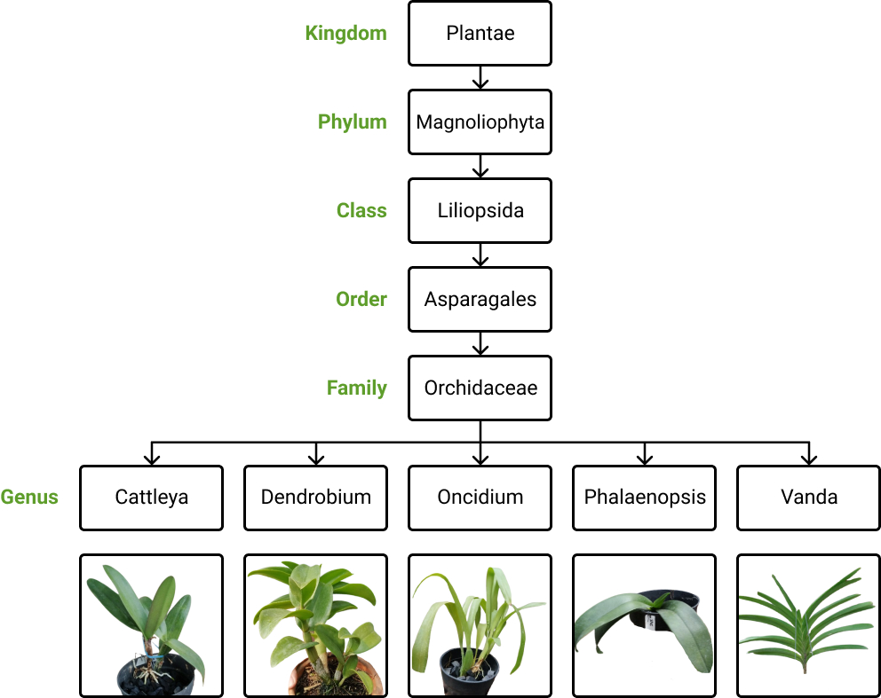
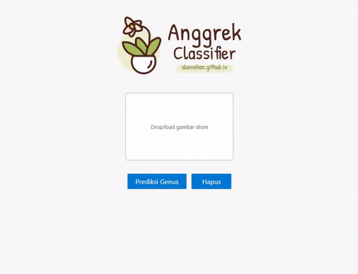
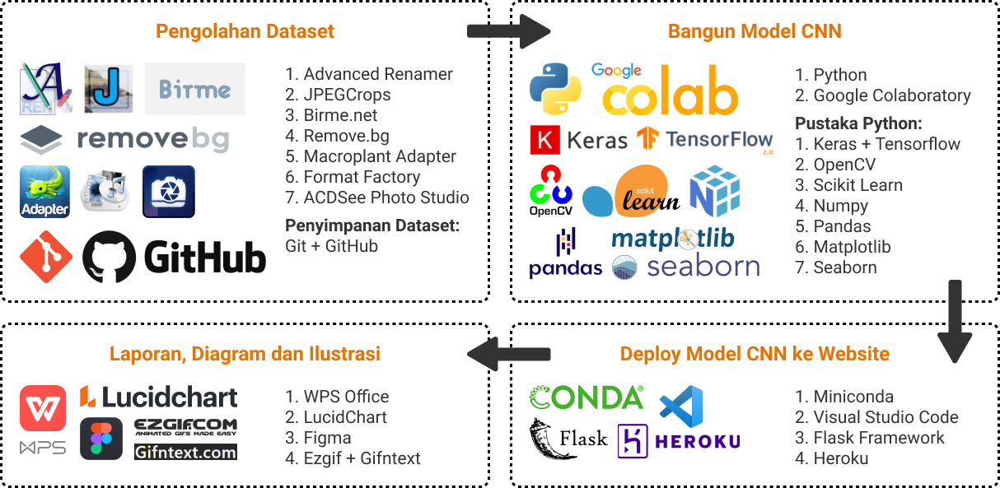

    <strong>🎓&nbsp; Klasifikasi Genus Tanaman Anggrek Menggunakan Metode Convolutional Neural Network (CNN)</strong>

    
    
    

---

## ⚠️ Batasan Aplikasi

Citra yang dapat diklasifikasikan oleh sistem hanya citra 5 genus tanaman anggrek yang umum dibudidayakan, yaitu Cattleya, Dendrobium, Oncidium, Phalaenopsis dan Vanda. Bentuk dan warna daun menjadi fokus utama citra. Selain itu citra memiliki pencahayaan yang baik, sudut yang tidak terlalu atas maupun bawah, serta latar belakang yang tidak terlalu ramai (noise).

## 🌐 Demo Aplikasi

## ⚔️ Teknologi & Tools yang digunakan

